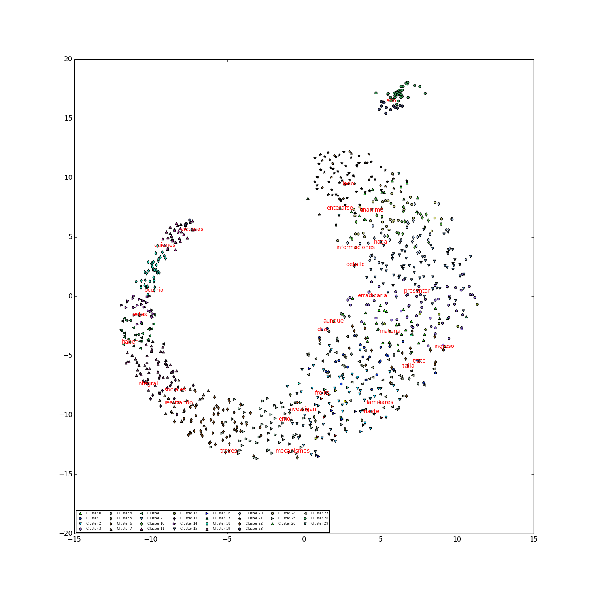

# Clustering words in the news: an example with femicide news

I have been taking the Unsupervised ML course in Udemy which you can find here:<br>
https://www.udemy.com/cluster-analysis-unsupervised-machine-learning-python <br>
And here you can find the original code:<br>
https://deeplearningcourses.com/c/cluster-analysis-unsupervised-machine-learning-python

At the end of the k-means section an example code is taught where soft k-means is used to find clusters of words in documents. This is my version to understand and apply that code.

<b>Data</b>: In this version the data is taken from about 30 to 40 news from "Emol.cl", an online chilean newspaper, that are retrieved when you search "femicide" (in Spanish, of course). I wanted to try the code on relevant data to see what kind of words where clustered together in this relevant topic. <br><br>
<b>Features</b>: Each sentence/fragment in the news data is embedded using Gensim Word2Vec. Then each word is represented with an embedding vector of the similarity of that word with all the other words in the data.<br><br>
<b>Visualization</b>: The resulting embeddings are visualized using dimensionality reduction techniques, you can choose between t-SNE and PCA.<br><br>
<b>Soft k-means</b>: The complete embedding matrix is used as input to soft K-means to find clusters of the words. The goal is to find which words tend to appear together or related and with such representation have some insights about the topic of the data and the editor's view of the topic. In the code you can find further details about the algorithm.<br><br>
<b>Output</b>: the script outputs the clusters found and the words in it and a scatter plot of the reduced data with the word found closest to the centroid of the cluster.

### Results

The idea of this project was to use this algorithms and models to extract representations on a topic that is very relevant to me. I analyzed the representation I was creating at several steps in the process.

1) Word embedding model: checking the closest words to some relevant keywords.

The word embedding model allows to obtain the words that are closest to a keyword. For example, you can see that "hombre" and "mujer" (men and woman) have a similar representation given that they are involved in the event.

```
Words closest to "hombre"
[(u'violencia', 0.7981762290000916), (u'femicidio', 0.794640064239502), (u'mujeres', 0.7895470857620239), (u'mujer', 0.78425133228302), (u'no', 0.7821941375732422), (u'legal', 0.7791281938552856), (u'contra', 0.7712581157684326), (u'victima', 0.7697762846946716), (u'pareja', 0.7689832448959351), (u'carabineros', 0.7614375352859497)]

Words closest to "mujer"
[(u'contra', 0.8472951054573059), (u'violencia', 0.8427916765213013), (u'mujeres', 0.8367606997489929), (u'femicidio', 0.8354204893112183), (u'no', 0.8242781758308411), (u'pareja', 0.8217502236366272), (u'victima', 0.8059316873550415), (u'carabineros', 0.7945513129234314), (u'legal', 0.7912412881851196), (u'habria', 0.7858884930610657)]
```

However, if you compare "asesino" and "victima" (murderer and victim), the representations are:

```
Words closest to "asesino"
[(u'carabineros', 0.2792244255542755), (u'acusado', 0.26279664039611816), (u'hija', 0.2594226896762848), (u'region', 0.2566441595554352), (u'arma', 0.25612837076187134), (u'sin', 0.2532888352870941), (u'hecho', 0.2503329813480377), (u'detenido', 0.24895012378692627), (u'caso', 0.24667774140834808), (u'homicidios', 0.24482499063014984)]

Words closest to "victima"
[(u'femicidio', 0.8261522054672241), (u'violencia', 0.8070477247238159), (u'mujeres', 0.8070352077484131), (u'mujer', 0.8059316873550415), (u'contra', 0.7956814169883728), (u'pareja', 0.7954514622688293), (u'no', 0.778271496295929), (u'habria', 0.7752811312675476), (u'familia', 0.7734053730964661), (u'legal', 0.7698884010314941)]
```

One thing that I notice right away is that in "woman" and in "victim" we have the word "habría" which means "it would".

Only by checking the frequency of the words some interesting points come up: for example, the word murderer only appeared 6 times in all the data while the news preferred other words to refer to this person, such as "acusado" (accused) 22 times, or "pareja" (partner) 88 times, or simply "hombre" (men) 60 times.

You can run these command with different relevant words and make your conclusions.


2) t-SNE visualization: given the high dimensions of our data we can't directly visualize the k-means results.
Therefore, we apply a dimensionality reduction technique to visualize. However, at the same time I don't want to
lose the information given by k-means. Because of that the scatter plot is plotting the data points using the coordinates
given by t-SNE but the symbols are representing the cluster the points belong to and additionally, a word was annotated, the datapoint closest to the centroid of the cluster.



3) Soft k-means clusters: finally, the clustered words are printed by the script. The cluster will change each time given the randomization of some parts of the algorithm. This particular algorithm is very interesting because is a "soft" k-means, which means it does not only gives you the cluster each data point belongs to, but we also a responsibility matrix (R) that says how much each data point belongs to each cluster. It would be interesting to see which clusters share data points. In our data the words that refer to the participants and the event of the femicide tend to appear in similar clusters, while the declarations of the government are other entities are separated, as well as other words related to the topic but that do not correspond to the event itself, for example, words that are speaking about demonstrations or criticism to these (such as "feminazi").

### Conclusions

Finally, all this information is valuable to understand how this topic is being modeled and represented in the news. We could feed the script with other sort of the data and extract these representations. The main advantage of the presented algorithms and models is the fact that they unsupervised: this process did not required manually labeled data (the only manual labor was probably to append some specific stopwords). Therefore, is an approach we can use with any dataset available to have a first insight on how that text data is represented.
